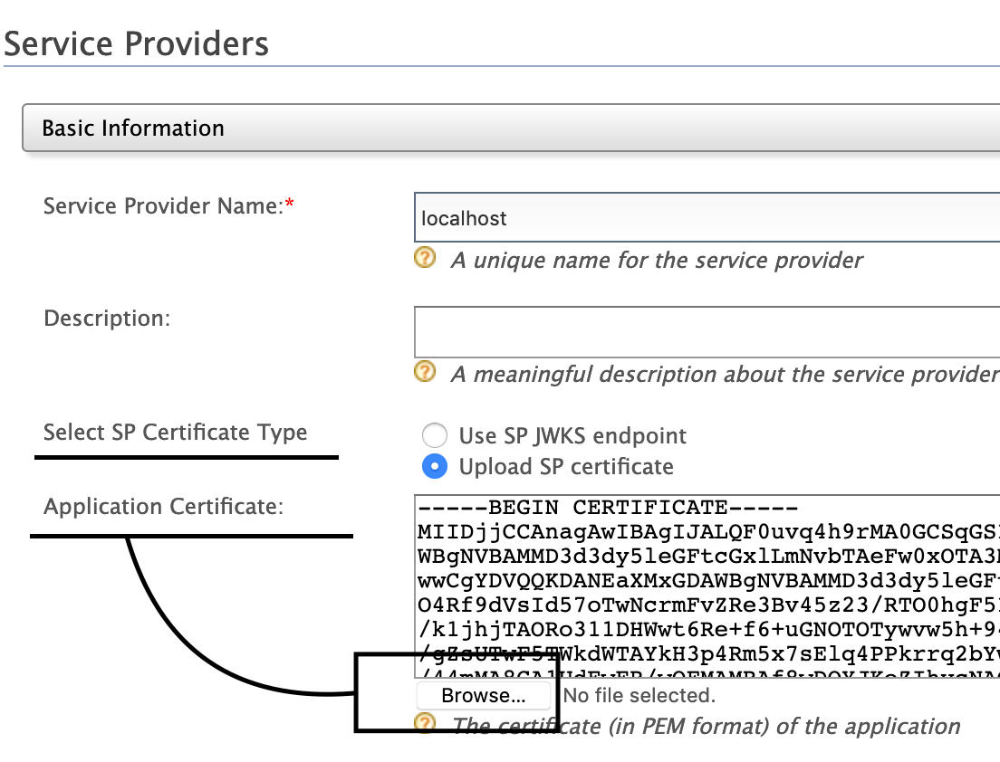

# SAML

The eQIP prototype uses wso2 identity server as its SAML provider. The exact distribution used is only currently available to folks within GSA, but for development purposes a fresh install of wso2is 5.8.0 will suffice.

## Setting up SAML

### Dependencies

wso2is uses a lot of resources during startup. Make sure your Docker daemon has allotted enough resources, or it will silently kill the server before it's done initializing. To successfully launch the full eApp cluster, use the following settings (under Docker > Preferences > Advanced):
- 3+ GB memory
- 3+ CPU cores

### Initial Configuration

To authenticate with SAML rather than the basic auth:

1. Start the Identity Server. If you did not install wso2is in the previous step, then the script will pull 5.8.0 from docker hub.

    ```shell
    make identity
    ```

1. Set up SAML Provider.
    1. [Visit WSO2 console.](https://localhost:9443/carbon)
    1. Click through the certificate warning in your browser.
    1. Log in with username and password of `admin`.
    1. [Add a Service Provider](https://localhost:9443/carbon/application/add-service-provider.jsp) with the Name `localhost`.
    1. Go into the `Inbound Authentication Configuration`->`SAML2 Web SSO Configuration` section, then click `Configure`.
    1. Fill out the form.
        - Issuer: `localhost`
        - Assertion Consumer URLs: `http://localhost:3000/auth/saml/callback`, then click `Add` <!-- this should match SAML_CONSUMER_SERVICE_URL -->
        - Uncheck everything but `Enable Response Signing`
        - Check `Enable Single Logout`, no need to set SLO request or response URLs
1. Copy the eApp certificate to wso2.
    1. Go back to [the service provider settings](https://localhost:9443/carbon/application/add-service-provider.jsp).
    1. Edit your new `localhost` certificate.
        
    1. Make sure Upload SP certificate is selected (`Select SP Certificate Type`).
    1. Click the browse button under `Application Certificate`, and select or copy the contents of the cert located in `e-QIP-prototype > api > eapp.crt`.
    1. Save these changes.
1. Copy the wso2 certificate to eApp.
    1. [Go to `Identity Providers`->`Resident`.](https://localhost:9443/carbon/idpmgt/idp-mgt-edit-local.jsp)
    1. Expand `Inbound Authentication Configuration`, then `SAML2 Web SSO Configuration`.
    1. Click `Download SAML Metadata`.
    1. Open up the resulting SAML Metadata XML file that gets downloaded, and copy the contents of the `<X509Certificate>` element.
    1. Save that in `api/wso2.crt`.

        ```
        -----BEGIN CERTIFICATE-----
        <contents>
        -----END CERTIFICATE-----
        ```

1. Enable SAML on the "client" side.
    1. Make sure your `.env` has the `SAML_*` defaults from `.env.example`.
    1. In your `.env`, set `BASIC_ENABLED=` and `SAML_ENABLED=1`.

### Optional configutation changes

Since wso2is is very verbose, you may wish to reduce its logging levels. You can adjust this under Configurations (menu at far left) > Logging > Global Log4j Configuration. These changes will take effect immediately, though be warned that the server will always log the first 70ish INFO statements during startup.

## Running the full eApp cluster with SAML

Once you have completed the initial configuration, you can launch the full cluster including wso2is:

```shell
make run-saml
```

Or if you still have `make identity` running, you can launch the rest of the cluster with:

```shell
make run
```

Sometimes when cancelling the process, docker fails to shut down the containers. You can drop them with:

```shell
make stop-saml
```

### Login with PIV or CAC

1. Visit [http://localhost:8080](http://localhost:8080).
1. `Log in with PIV/CAC`, with username and password of `admin`.
<!--
# TODO: update with what it looks like on 5.8.0
-->

## Caveats

Note this is using an off-the shelf WSO2 server, which won't match production in that:

* It's not hardened
* Using an embedded database rather than an external one
    * **NOTE:** *If you delete the SAML server container the SAML Provider data will be lost along with the embedded database*
* The WSO2 verison may not match
* etc.
